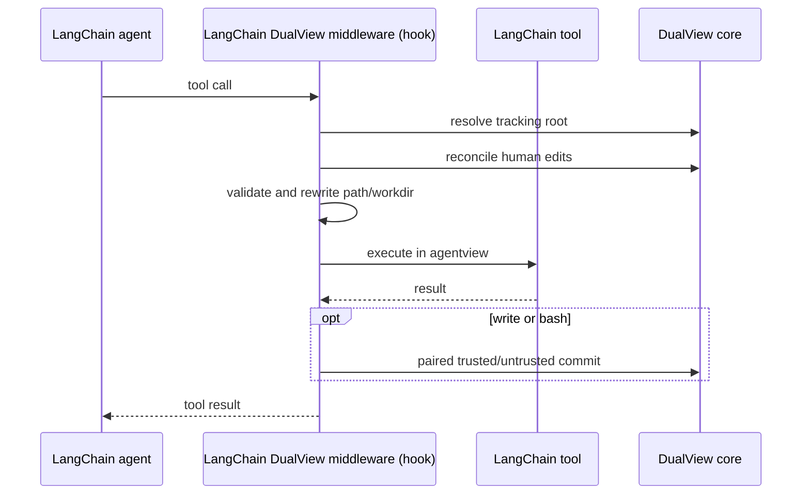

# LangChain Integration

## Goal

Demonstrate that DualView dataflow and filesystem protections can be embedded
as LangChain JS middleware without replacing LangChain's agent loop.

The research prototype reuses canonical DualView policy, symbols, filesystem
views, restricted execution, audit, and provenance. A production package is
not a goal.

## Terminology

| Term | Meaning |
| --- | --- |
| **LangChain DualView middleware (hook)** | The LangChain middleware in `plugin/langchain/index.ts`. Its `wrapToolCall` lifecycle acts as a hook around mapped tool calls: it validates and rewrites their paths, then invokes the DualView core. |
| **DualView core** | The existing framework-independent filesystem and git implementation in `plugin/dualview/`. It owns `agentview`, human-edit reconciliation, symbol resolution, and paired provenance commits. |
| **Human File System** | The normal workspace visible to the user, with symbols resolved. |
| **Agent File System** | The corresponding `agentview` visible to the agent, with symbols preserved. |

The LangChain DualView middleware (hook) is not a second DualView
implementation. OpenClaw hooks and the LangChain middleware call the same
DualView core.

## Package Layout

| File | Responsibility |
| --- | --- |
| `plugin/langchain/index.ts` | LangChain DualView middleware (hook), tool mapping, path rewriting, bundled file/bash tools |
| `plugin/langchain/dataflow-runtime.ts` | Framework-neutral inbound symbolization, outbound resolution, command audit, and final-response resolution |
| `plugin/langchain/adfi-runtime.ts` | LangChain adapters for canonical `inspect_symbol` and policy tools |
| `plugin/langchain/copilot-chat-model.ts` | Optional LangChain `BaseChatModel` adapter for GitHub Copilot SDK |

The integration imports the existing implementations from `plugin/dualview/`:

- `dualview-ondemand.ts`: root discovery and canonical Agent File System
- `dualview-human-edit.ts`: Human File System reconciliation
- `dualview-filecommit-ondemand.ts`: paired trusted/untrusted commits
- `dualview-paths.ts`: canonical workspace identity and storage paths
- `policy/`: shared inbound, outbound, runtime, and command policies

No LangChain-specific copy of policy, git, or file synchronization logic
exists.

## Extensibility Boundary

```typescript
const dualView = createDualViewIntegration({ workspacePath });
const agent = createAgent({
  model,
  tools,
  middleware: [dualView.middleware],
});
```

- LangChain owns the agent loop, message history, retries, model, and dispatch.
- The application supplies normal LangChain-compatible models and tools.
- DualView wraps model input, tool calls, tool results, filesystem views, and
  final output.
- Bundled tools are optional; existing tools can be mapped with
  `toolOperations`.
- Copilot JSON action conversion is adapter scaffolding, not part of the core
  runtime integration.

The supported claim is that DualView can be embedded into another agent
framework without replacing its agent loop. This prototype does not claim a
universal drop-in plugin: final-response resolution is explicit, protected
restricted execution requires the bundled shell, and OpenClaw-specific
channels, sessions, and skills have no LangChain equivalent.

## Runtime Flow

`createDualViewMiddleware()` uses LangChain's `wrapToolCall` lifecycle:



The middleware serializes supported calls per instance. This prevents
reconciliation and commit operations from racing within one workspace.

### Tool Mapping

Built-in names:

| Operation | Default name | Accepted path/workdir fields |
| --- | --- | --- |
| Read | `read_file` | `path`, `file_path`, `filepath` |
| Write | `write_file` | `path`, `file_path`, `filepath` |
| Bash | `bash` | `workdir`, `cwd` |

Callers can:

- Rename bundled tools with `toolNames`.
- Disable bundled tools with `includeTools: false`.
- Map existing tools with `toolOperations`.

Paths are canonicalized, required to remain within `workspacePath`, then
rewritten to the matching path under `agentview`. Bash defaults its working
directory to `agentview`.

## Model Integration

The LangChain agent accepts any LangChain-compatible chat model. DualView is
model-independent.
LangChain v1 `createAgent()` already executes on the LangGraph runtime. This
prototype uses the higher-level agent middleware API and does not build a raw
LangGraph workflow.

### GitHub Copilot

`CopilotChatModel` adapts the official `@github/copilot-sdk` to LangChain:

- Reuses the logged-in Copilot CLI user.
- Uses SDK `empty` mode.
- Disables Copilot runtime tools with `availableTools: []`.
- Converts LangChain tool schemas into a tool-selection prompt.
- Returns one LangChain tool call or final response per model invocation.
- Supports `auto` or an account-visible model ID.

LangChain remains the only agent loop and tool executor. The Copilot SDK cannot
bypass the LangChain DualView middleware (hook) by invoking its own tools.

The JSON tool-selection protocol is prototype scaffolding. Native structured
tool calling should replace it when the SDK exposes a stable model-only API.

## Capability Matrix

| ADFI capability | LangChain status | Notes |
| --- | --- | --- |
| DualView path isolation | Done | Read, write, and bash workdir |
| Human-edit reconciliation | Done | Shared implementation |
| Git provenance | Done | Shared paired commit pipeline |
| Workspace containment | Done | Rejects escaping file paths/workdirs |
| Inbound tool-result classification | Prototype | Shared policy engine runs before results enter LangChain history |
| Tool-result symbolization | Prototype | Untrusted text is persisted as DualView symbols |
| Outbound parameter resolution | Prototype | Shared tool policy resolves symbols before mapped tools run |
| Final response resolution | Prototype | Explicit integration handle resolves the final `AIMessage` |
| `inspect_symbol` and U-LLM | Prototype | Existing DualView tool with an isolated model invocation |
| Shared YAML policy | Prototype | Existing policy loader, runtime manager, and `policy_list`/`policy_add`/`policy_del` tools |
| Policy-backed files | Prototype | Explicit untrusted directories are seeded into the Agent File System with `policy_file` symbols |
| Untrusted command audit | Prototype | Canonical command-pattern detection and argv lowering protect symbol-backed exec commands |
| Restricted exec | Prototype | Canonical Linux namespace wrapper; best-effort macOS `sandbox-exec` fallback |
| Session symbol lifecycle | Prototype | Application closes the integration after `agent.invoke()` |
| Webhooks and channels | Not applicable | LangChain has no channel abstraction in this scope |

## Roadmap

The work is limited to what is needed for a runnable prototype.

### 1. Implement LangChain data-flow operations

- [x] Implement framework-local operations around the existing DualView policy
  and symbol modules:
  - `prepareModelInput()` for symbol guidance
  - `prepareToolCall()` for outbound parameter policy and resolution
  - `processToolResult()` for inbound classification and symbolization
  - `processFinalResponse()` for user-boundary resolution
  - `closeSession()` for symbol ownership cleanup
- [x] Reuse the existing policy loader, schema walker, symbol table, symbol
  format, and audit record shape.
- [x] Keep the prototype isolated from OpenClaw hook registration.

**Done when:** LangChain applies the existing policy and symbol primitives
without changing OpenClaw behavior.

### 2. Connect the operations to LangChain middleware

- [x] Create one `AdfiLangChainRuntime` and one serialized
  `DualViewLangChainRuntime` per middleware instance. No process-global
  LangChain state is used.
- [x] Extend `wrapToolCall` in this order:
  1. Call `prepareToolCall()` on the original tool arguments.
  2. Apply DualView path or workdir rewriting.
  3. Invoke the tool handler.
  4. Call `processToolResult()` on the returned result.
  5. Return one symbolized `ToolMessage` to LangChain.
  6. Run the existing DualView commit handler for write-capable tools.
- [x] Connect the model-input middleware lifecycle to `prepareModelInput()` so
  symbol guidance is included in each applicable model request.
- [x] Expose `resolveFinalResponse()` for the application boundary without
  replacing the symbolic message stored in LangChain history.
- [x] Expose `closeSession()` for application cleanup in a `finally` block.
- [x] Register the existing `inspect_symbol` implementation with async U-LLM
  invocation and derived-symbol handling.
- [x] Emit middleware audit records through `onAudit`.

`processToolResult()` runs before LangChain inserts the tool result into agent
state. Therefore the stored history and every later model context use that same
symbolized `ToolMessage`; no second history-processing pass is required.

**Done when:** a LangChain agent can receive an untrusted tool result, store
only its symbolized `ToolMessage`, use the symbol in a later tool call, and
return a resolved final response.

## Explicitly Out of Scope

- Publishing or versioning a standalone LangChain package
- A stable public API or backward-compatibility guarantee
- Streaming response support
- LangGraph checkpoint integration
- Direct support for custom raw LangGraph workflows; those workflows must add
  equivalent ADFI processing around their tool nodes
- Multi-agent and multi-process concurrency guarantees
- Full OpenClaw tool-catalog parity
- Production restricted-exec hardening and cross-platform sandbox parity
- Native Copilot structured tool calling
- Credentialed live-model runs as a required CI gate

## Known Limitations

- macOS restricted exec cannot virtualize absolute Human File System paths;
  it denies access to tracked Human File System roots instead. Linux uses the
  canonical bind-mount namespace.
- Restricted trust promotion is limited to the bundled shell tool because
  middleware cannot control pre-exec environment handling in external tools.
- Unrestricted shell text writes are captured as untrusted symbols before a
  later restricted call can read them. Binary writes remain exact in the Human
  File System and are represented by opaque symbols in the Agent File System.
- Unrestricted shell execution blocks writes to agentview and DualView
  metadata; restricted execution also blocks metadata reads.
- Successful bash calls commit all detected workspace changes because shell
  commands do not declare a write set.
- Failed tools do not commit, but partial filesystem side effects from a failed
  shell command can remain until a later reconciliation decision.
- The LangChain DualView middleware (hook) covers only mapped tools. Unknown
  tools bypass the DualView core.
- The current live-model adapter depends on Copilot CLI authentication and the
  account-visible model catalog.
